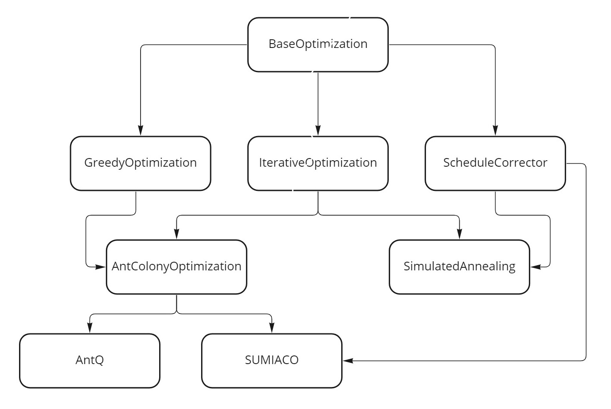

# SchedulingProblem

В репозитории содержатся некоторые алгоритмы для построения 
однопроцессорного расписания с минимизацией пикового использования ресурса.

## Структура проекта
Все классы и функции содержатся в основном пространстве имён _scheduling\_problem_. 
Переопределения типов описаны в файле _general\_types.h_. Проект состоит из нескольких 
алгоритмов оптимизации и некоторых расширений для работы с ними.

## Алгоритмы оптимизации
Проект содержит несколько классов, представляющих алгоритмы оптимизации:
* **BaseOptimization** — базовый класс для всех остальных алгоритмов 
оптимизации; предоставляет методы для построения случайного корректного расписания;
* **IterativeOptimization** — базовый класс для итерационных алгоритмов 
планирования (**SimulatedAnnealing**, **AntColonyOptimization**); 
предоставляет различные методы и переменные для рассчёта и хранения 
промежуточных результатов, получаемых на каждой итерации;
* **GreedyOptimization** — простой жадный алгоритм, основанный на максимизации 
освобождаемого ресурса;
* **AntColonyOptimization** — алгоритм муравьиных колоний;
* **SUMIACO** — алгоритм муравьиных колоний с локальным поиском 
(основан на алгоритме муравьиных колоний и коррекции расписания);
* **AntQ** — алгоритм муравьиных колоний, основанный на подходе _Q-learning_.
* **SimulatedAnnealing** — алгоритм имитации отжига.

Каждый класс, представляющий алгоритм, включает в себя метод _schedule_ 
для решения задачи построения однопроцессорного расписания с минимизацией 
пикового использования ресурса. Данный метод принимает на вход объект 
типа _scheduling_problem::Graph_ и возвращает построенное расписание 
_scheduling_problem::Schedule_.

## Расширения

Все расширения описаны в пространстве имён _scheduling_problem::additionals_. 
Расширения включают в себя следующие классы и функции: 
* **ScheduleCorrector** — корректор расписания путём перестановки задачи с одной 
допустимой позиции на другую (т.е. с сохранением корректности расписания);
* **CorrectnessTester** — используется для проверки корректности построенных графов;
* **TableContent** — таблица для хранения результатов экспериментов. 
Содержит метод _to\_csv_, который записывает таблицу с результатами в csv-файл;
* _printNetwork_ — функция для вывода структуры объекта типа 
_scheduling_problem::Graph_;
* _printSolution_ — функция для вывода структуры объекта типа 
_scheduling_problem::Schedule_;
* _serializeGraph_ — сериализация графа в _.txt_.
* **DAGGenerator** — генератор графов, принимающий на вход интервалы для числа 
вершин, плотности и объёма ресурсов в каждой вершине, а также число генерируемых 
графов и размер батча _batchSize_. Генератор принимает на вход хранилище размера 
_batchSize_, заполняет его графами с числом вершин, плотностью и объёмами ресурсов из 
поданных интервалов и возвращает размер текущего батча.
* **DAGReader** — используется для считывания сериализованных графов. Работает по 
той же схеме, что и **DAGGenerator**, но вместо интервалов, из которых берутся значения
для генерируемых графов, принимает на вход путь к дериктории с сериализованными графами.

## Эксперименты 

В пространстве имён _scheduling_problem::experiments_ описаны некоторые функции,
которые используются для запуска экспериментов:
* _runsNumberSelection_ — функция для поиска оптимального числа запусков алгоритмов
на каждом графе для последующего вычисления среднего и дисперсии;
* _algorithmsTesting_ — функция для запуска алгоритмов на наборе данных заданное число раз.
* _gridSearch_ — функция для запуска поиска по сетке для определённого алгоритма.

Все функции устроены похожим образом: каждая принимает на вход множество алгоритмов, 
**DAGGenerator**/**DAGReader**, директорию для записи результатов и некоторые 
особенные для каждой функции параметры (например, параметрическая сетка для 
_gridSearch_) и формирует таблицы с результами экспериментов.

## Компиляция

В проекте используется [Boost Graph Library](https://www.boost.org/doc/libs/1_77_0/libs/graph/doc/index.html), 
поэтому для его компиляции необходимо установить [boost](https://www.boost.org/).

Если вы используете MSVS, укажите _boost/include_ и _boost/libs_ пути в настройках проекта
и соберите его. Иначе откройте файл _build/makefile_ и укажите корневую директорию для 
boost. Во втором случае для сборки статической библиотеки необходимо открыть терминал,
перейти в директорию build и прописать _'make libspschd.a'_, для сборки примера с
экспериментами — _'make'_.

## Тестирование

Для запуска проекта не через MSVS необходимо открыть терминал, перейти в 
дерикторию _build_ и прописать _'./example <cmd>'_. Примеры комманд <cmd> приведены в 
файле _data/commands\_examples.txt_. Примеры json-описания алгоритмов, 
параметрической сетки и прочего содержатся в дериктории _data_. 
